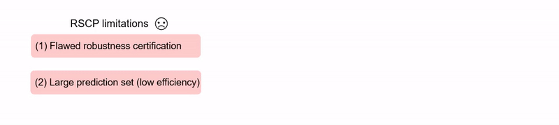

# Robust Conformal Prediction with Improved Efficiency
This is the official repository for our ICLR24 paper [Provably Robust Conformal Prediction with Improved Efficiency](https://openreview.net/pdf?id=BWAhEjXjeG). For more introductions, please refer to our [project website](https://lilywenglab.github.io/Provably-Robust-Conformal-Prediction/).
## Overview
This work address the limitations of [RSCP (Gendler etal, ICLR 23)](https://openreview.net/pdf?id=9L1BsI4wP1H) and provide robustness guarantee in evaluation. Two novel methods, Post-Training Transformation (PTT) and Robust Conformal Training (RCT), are also proposed to effectively reduce prediction set size with little computation overhead. 

In this repo, we provide two python scripts:
* `RSCP_exp.py`. This script implements the PTT method and compare evaluation results with RSCP. 
* `conftr_CIFAR_robust.py` . This script trains a model with our robust conformal training on CIFAR10 and CIFAR100. The model could further be evaluated by `RSCP_exp.py` by setting command line argument `--use-conftr`.  

For usage details, please refer to the "Usage" section below. This codebase is based on the open source codes from [RSCP](https://github.com/Asafgendler/RSCP).

## Preparation

1. Install python dependencies:
* matplotlib, numpy, pandas, plotnine, pytorch & torchvision, scipy, seaborn, tqdm, scikit-learn, [torchsort](https://github.com/teddykoker/torchsort).
2. Prepare data: Please refer to "Running instructions" Step 2 of [RSCP](https://github.com/Asafgendler/RSCP).
3. Run `mkdir img`. 
## Usage
### Robust Conformal Training (RCT)
For training a CIFAR10 model, use
```
python code/confTr_CIFAR_robust.py --batch_size 500 --alpha 0.1 --lr 0.05 --n-train 8 --max_epochs 150 --target_size 1 --size_weight 1 --temp 0.1 --dataset CIFAR10 --model_path Pretrained_Models/Cohen/cifar10/resnet110
```
For training a CIFAR100 model, use
```
python code/confTr_CIFAR_robust.py --batch_size 100 --alpha 0.1 --lr 0.005 --n-train 8 --max_epochs 150 --target_size 1 --size_weight 0.01 --temp 1 --dataset CIFAR100 --model_path checkpoints --use_phi
```
### Post-Training Transformation
In order to conduct out PTT method and compare with baseline:

For evaluating metrics on CIFAR10, use
```
python ./code/RSCP_exp.py --batch-size 8192 --dataset CIFAR10 --model-type Cohen --cleanonly
```
For evaluating metrics on CIFAR100, use
```
python ./code/RSCP_exp.py --batch-size 8192 --dataset CIFAR100 --model-type RSCP --cleanonly
```
For evaluating metrics on ImageNet, use
```
python ./code/RSCP_exp.py -d 0.25 --batch-size 512 --dataset ImageNet --model-type Cohen --cleanonly
```
To evaluate RCT model, use flag `--use-conftr`.

## Cite this work
G. Yan, Y. Romano and T.-W. Weng, **Provably Robust Conformal Prediction with Improved Efficiency**, ICLR 2024.
```
@inproceedings{
yan2024provably,
title={Provably Robust Conformal Prediction with Improved Efficiency},
author={Ge Yan and Yaniv Romano and Tsui-Wei Weng},
booktitle={The Twelfth International Conference on Learning Representations},
year={2024},
url={https://openreview.net/forum?id=BWAhEjXjeG}
}
```
